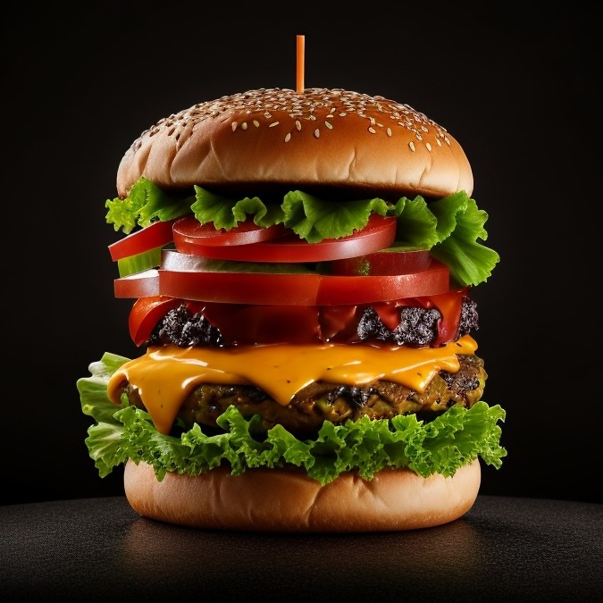

```markdown
## 🍔 Burger Hut

**Burger Hut** is a sleek, responsive website designed with pure **HTML** and **CSS** to showcase a delicious burger menu. It features eye-catching layouts, smooth navigation, and vibrant visuals, offering users an engaging and modern restaurant website experience.

---

## 🌟 Features

- 🍔 Stylish homepage with hero banner
- 📋 Menu section highlighting signature burgers
- 📸 Interactive gallery of food images
- 👤 Customer testimonials section
- 📞 Contact information and social links
- 📱 Fully responsive design (mobile-friendly)
- ⚡ Lightweight and fast — no JavaScript required!

---

## 🖼️ Screenshots

Here are some visuals from the website:

| Hero Section | Menu Items | Customer Testimonials |
|--------------|------------|------------------------|
|  |  |  |
|  |  |  |

> All images are located in the root directory and used directly in the webpage.

---

## 📁 Project Structure

Burger-hut/
├── index.htm               # Main HTML page
├── styles.css              # CSS styles
├── burger1.jpg             # Menu images
├── burger2.jpg
├── burger3.jpg
├── customer1.jpg           # Testimonial images
├── customer2.jpg
├── gallery1.jpg            # Gallery images
├── gallery2.jpg
├── gallery3.jpg
├── gallery4.jpg
├── hero-background.jpg     # Hero background image
├── hero-background1.jpg
├── iconlogo.png            # Site icons/logos
├── iconlogo1.png
├── about-image.jpg         # About section image
└── README.md               # Project documentation

````

---

## 🚀 Getting Started

### 1. Clone the Repository

```bash
git clone https://github.com/Tapon5086/Burger-hut.git
cd Burger-hut
````

### 2. Open the Project

Simply open `index.htm` in your browser:

```bash
start index.htm   # For Windows
open index.htm    # For macOS
```

Or drag and drop it into your browser.

---

## 📦 Deployment

You can host this static website on:

* **GitHub Pages** (already deployed)
* **Netlify**
* **Vercel**
* Any static web server (Apache, Nginx)

---

## 🧑‍🍳 Customization

* 🔧 Edit `index.htm` to update content, burger names, or pricing.
* 🎨 Modify `styles.css` to apply your own branding or design.
* 🖼️ Replace images in the project folder with your own visuals.

---

## 🤝 Contribution

Contributions are welcome!
Feel free to fork this repo and submit a pull request for new features or design improvements.

---

## 📄 License

This project is licensed under the [MIT License](LICENSE).

---

## 👤 Author

**Tapon Paul**
[GitHub](https://github.com/Tapon5086) • [LinkedIn](https://linkedin.com/in/taponpaul)

```
